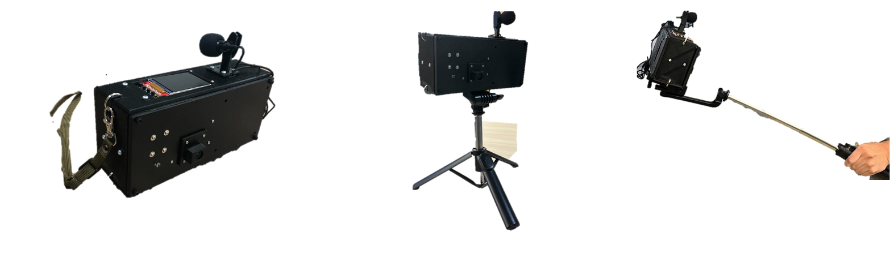
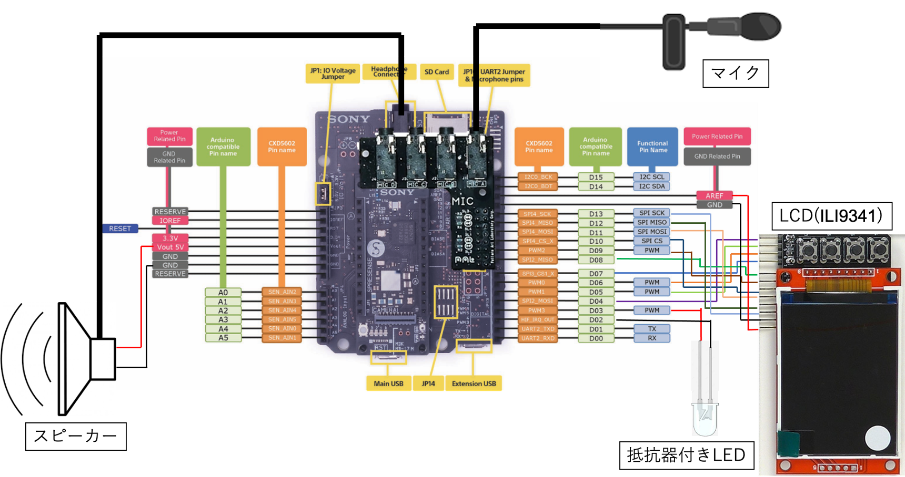
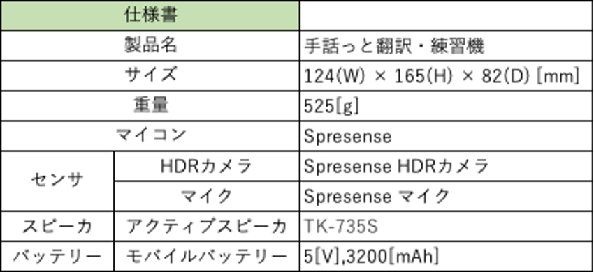

# syuwatto-translator


## 製品について
本製品は指文字を用いた円滑なコミュニケーションを助けるデバイスである。



## レポジトリの構成
・hardware ： 3Dモデルや配線、パーツリスト等のハード設計に関するデータ

・spresense ： SPRESENSEに書き込むプログラム

・server ： serber用のプログラム

## ビルド
1.SPRESENSEのArduinoプロジェクトがビルドできる状態にします(詳細はSonyのSPRESENSE公式ページをご覧ください)。

2.ArudinoIDEで〇〇にある〇〇.inoを開いてください。

3.SPRESENSEをPCに接続します。

4.〇〇.inoをマイコンに書き込みます。

## センサーについて
この製品を扱うにあたって、SPRESENSEとセンサーの接続は以下の画像を参考にしてください。



また、仕様書は以下の通りになります。



## 使い方


## クラウド(サーバー)側使い方
```bash

```

## 機能
本製品の機能は以下の通りです。

・指文字から音声への翻訳

・音声からテキストへの翻訳

・指文字の練習機能

詳しくは以下の動画をご覧ください

[](https://github.com/rsdlab/syuwatto-translator/assets/105686812/fd62dd02-c0c1-43e5-8c7f-474890054772)

## システムモデル

本製品のシステム構成のイメージ図は以下の通りです。


## Contributors
Satoshi Kikuchi ([m-SKikuchi](https://github.com/m-SKikuchi))<br>
Kazuya Yabashi ([yakazuya](https://github.com/yakazuya))<br>
Masatomo Inoue ([InoueMasatomo](https://github.com/InoueMasatomo))<br>
AyatoTakagi ([tadrone](https://github.com/tadrone))

## Contacts
If you have further question, email to 233427037@ccmailg.meijo-u.ac.jp
